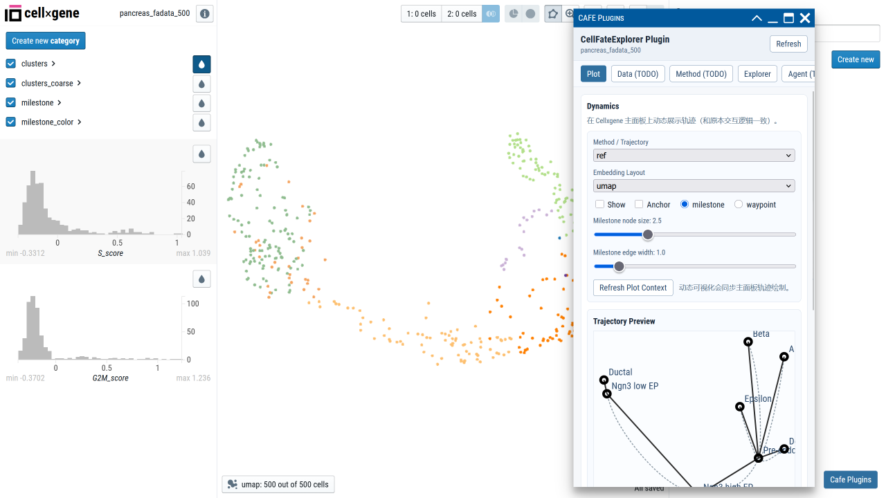

# cellxgene-cafe

This directory contains the plugin-style integration between Cellxgene and Cafe.

Read the architecture guide first:

- [ARCHITECTURE.md](./ARCHITECTURE.md)

## Current Status

- Plot module: implemented (trajectory selector, show/anchor controls, trajectory type, node/edge sliders, preview, benchmark panel).
- Data module: placeholder.
- Method module: placeholder (job API endpoints are reserved).
- Explorer module: baseline implemented (benchmark view).
- Agent module: placeholder.

## Directory Responsibilities

- `server/cafe_api.py`: route layer for plugin APIs (manifest, context, static plot, gateway status, job placeholders).
- `server/cafe_util.py`: shared backend utility helpers (UNS loading, preview conversion, static rendering, fallback drawing).
- `scripts/inject_client.py`: injects the frontend plugin launcher and panel script into host HTML templates.
- `scripts/inject_server.py`: injects backend blueprint registration into host `app.py`.
- `client/src`: plugin frontend application.
- `plugin-manifest`: manifest example and schema.
- `gateway`: placeholder for multi-dataset control plane.

## One-Command Install Into Target Cellxgene Environment

Run inside `cafe-cellxgene/cellxgene-cafe`:

```bash
bash config.sh
```

The script will:

1. Build frontend bundle `dist/cafe-plugin.js`.
2. Copy backend connector files (`server/cafe_api.py` and `server/cafe_util.py`) into the target Cellxgene package path.
3. Copy plugin bundle into host static assets.
4. Inject backend blueprint registration and frontend loader hooks.

Optional environment overrides:

- `CELLXGENE_CONDA_ENV`: target conda env name (default `cellxgene_cafe`).
- `CELLXGENE_PYTHON`: explicit Python path for host resolution.
- `CELLXGENE_HOST_ROOT`: explicit host package root.

After installation, start Cellxgene as usual.

## Plugin Homepage Screenshot

